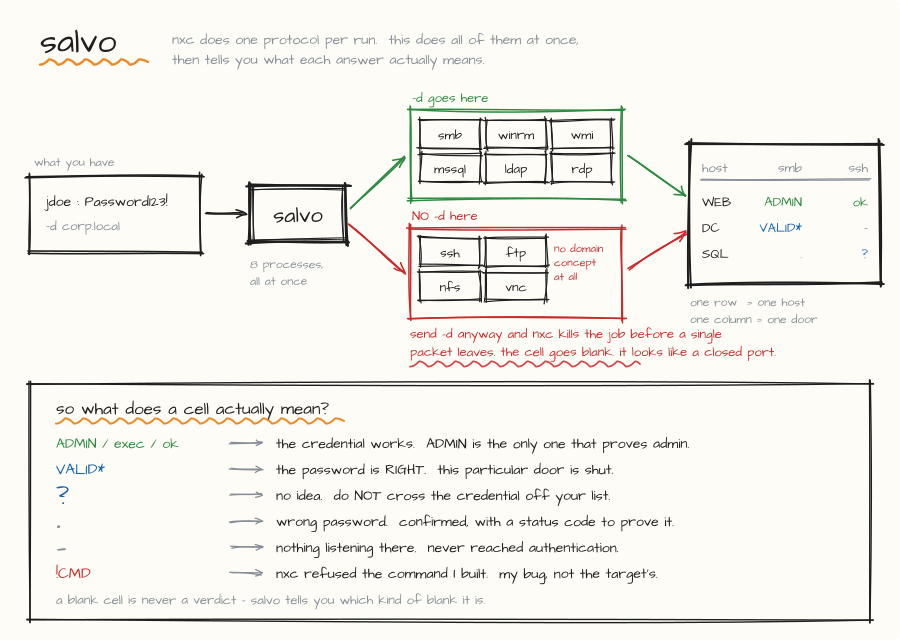

# salvo

[](https://github.com/aashiqoffortune-hash/salvo/actions/workflows/tests.yml)

Spray one or many credentials across **every NetExec protocol at once** and read the result as a matrix.



`nxc` takes one protocol per invocation. Testing a credential properly means running it eight times and reading eight scrollbacks. `salvo` runs them concurrently and prints one table — with an honest verdict in every cell.

```
host                       smb   winrm     wmi   mssql    ldap     rdp     ssh     ftp
--------------------------------------------------------------------------------------
192.168.100.10 (DC01)       ok       ?       ?   ADMIN      ok  VALID*       -       - <
192.168.100.25 (WEB01)   ADMIN       ?       ?      ok      ok  VALID*    exec       . <
192.168.100.26 (SQL01)      ok       ?       ?   ADMIN      ok  VALID*       -       - <

  ADMIN  = provably administrative (smb admin-share write, mssql sysadmin)
  exec   = code execution, NOT admin - check the smb column before assuming
  ok     = authenticated    VALID* = password correct, this access path blocked
  ?      = cannot tell, retest elsewhere    . = refused    - = no service / no answer
  !CMD   = nxc REJECTED the command salvo built - this cell was never tested
  n/a    = salvo ran NO job here - a fact about salvo, not about the host
  err    = salvo could not run this job - also not a verdict
```

Stdlib only. No pip, no virtualenv, no dependencies beyond `nxc` itself.

---

## Why

Two design decisions do the real work.

### 1. Three verdict buckets, not two

Most tooling has *worked* and *failed*. Collapsing everything else into *failed* is how a live credential gets thrown away.

| bucket | meaning |
|---|---|
| **valid** | `ADMIN`, `exec`, `ok` — the credential authenticated |
| **blocked** | `VALID*` — the password is **provably correct**, but this access path is closed |
| **unknown** | `?` — the service refused without saying why; it cannot be told apart from an authorization denial |

`VALID*` covers `STATUS_LOGON_TYPE_NOT_GRANTED`, `STATUS_ACCOUNT_DISABLED`, `STATUS_PASSWORD_EXPIRED`, `STATUS_PASSWORD_MUST_CHANGE`, and workstation or logon-hour restrictions. All of them mean the password checked out.

`?` is mostly WinRM. **A WinRM refusal is not an invalid credential** — a valid account that simply isn't in `Remote Management Users` looks byte-identical to a wrong password.

Under the matrix, a **NOT A VERDICT** block lists every blocked and unknown result with its reason. A credential in that list is still live.

### 2. `Pwn3d!` means different things on different protocols

NetExec prints `(Pwn3d!)` for several unrelated conditions. Treating them as one thing is a real trap, so `salvo` separates them:

| protocol | what `Pwn3d!` actually proves | rendered |
|---|---|---|
| `smb` | write access to `ADMIN$` / `C$` | `ADMIN` |
| `mssql` | `sysadmin` role on the instance | `ADMIN` |
| `winrm` | the account can execute — `Remote Management Users` grants this **with no admin rights at all** | `exec` |
| `ssh` | a uid-0 / passwordless-sudo probe that returns nonsense against Windows OpenSSH | `exec` |
| `wmi`, `rdp`, `ftp`, `vnc`, `nfs`, `ldap` | execution or access at best | `exec` |

If no protocol proved admin on a host, the follow-up commands say so:

```
NEXT:
  192.168.100.25 (WEB01)   winrm:exec, ssh:exec, smb:ok   [no admin proven on this host]
      evil-winrm -i 192.168.100.25 -u jdoe -p 'Password123!'   # NOT local admin here - expect to land as a standard user
```

### 3. A cell salvo never tested says so

Some jobs are never worth running: you cannot pass-the-hash over `ssh`, `ftp`,
`nfs` or `vnc`, and `nxc ldap` has no `--local-auth` because a directory bind is
always domain-scoped. salvo skips those rather than spending a logon to learn
nothing.

Skipping them quietly costs something, though. An absent result leaves an empty
cell, an empty cell reads as `-`, and `-` is defined right there in the legend as
*no service / no answer* — a claim about the target. Nothing was ever sent.

Those cells render **`n/a`**, with the reason printed under the table:

```
host                       smb   winrm     ssh     ftp
------------------------------------------------------
192.168.100.25 (WEB01)   ADMIN       -     n/a     n/a <
  n/a  ssh, ftp             nxc defines no -H here, so a hash cannot be tested over this protocol
```

`-` is a statement about the host. Every other empty-cell glyph is a statement
about salvo — `n/a` skipped, `!CMD` a command nxc rejected, `err` a job salvo
could not run at all — and each prints its reason under the table. `--json`
carries the same distinction in a `not_run` array, so a consumer of the file is
not left to infer it from an absence.

---

## Install

```bash
pipx install git+https://github.com/aashiqoffortune-hash/salvo.git
salvo --help
```

or with pip:

```bash
pip install --user git+https://github.com/aashiqoffortune-hash/salvo.git
```

Once the package is published to PyPI, `pipx install salvo-nxc` works too.

> **The package is `salvo-nxc`, not `salvo`.** `salvo` on PyPI is an unrelated
> HTTP load tester by another author, so `pip install salvo` gets you that, not
> this. The installed **command** is still `salvo`.

Requires Python 3.8+ and [NetExec](https://github.com/Pennyw0rth/NetExec) on
`PATH`. salvo itself has no Python dependencies — stdlib only, and a test
asserts it stays that way.

### Upgrading

```bash
pipx install --force git+https://github.com/aashiqoffortune-hash/salvo.git
```

or, from PyPI once published, `pipx upgrade salvo-nxc`.

If you installed an earlier salvo by hand — the old instructions said
`install -m 755 salvo.py ~/bin/salvo` — that copy is still there after an
upgrade, and PATH order decides which one runs. salvo checks for this on every
run and tells you:

```
[!] another 'salvo' is installed and PATH order decides which runs:
      /home/kali/bin/salvo
    this one: /home/kali/.local/bin/salvo
    If that is an older hand-installed copy, delete it and reinstall.
```

Running last month's parser against this month's NetExec produces confident,
wrong cells, which is the one failure this tool exists to prevent.

### From a clone

```bash
git clone https://github.com/aashiqoffortune-hash/salvo.git
cd salvo
python3 salvo.py --help    # runs as-is, no install step
```

---

## Usage

```bash
# one password, every protocol, whole subnet
salvo 192.168.100.0/24 -u jdoe -p 'Password123!' -d corp.local

# an NT hash against three known hosts, local authentication
salvo 192.168.100.10 192.168.100.25 192.168.100.26 \
    -u Administrator -H 31d6cfe0d16ae931b73c59d7e0c089c0 --local-auth

# every credential you hold, both auth scopes, table for your notes
salvo targets.txt -C creds.txt -d corp.local --both-auth --markdown

# over a slow tunnel
salvo 10.10.100.0/24 -C creds.txt -d corp.local --slow

# print the nxc commands, run nothing
salvo 192.168.100.0/24 -u jdoe -p 'Password123!' -d corp.local --dry-run
```

`creds.txt` — hashes are auto-detected (32 hex, or the `LM:NT` pair form):

```
jdoe:Password123!
Administrator:31d6cfe0d16ae931b73c59d7e0c089c0
CORP\svc_sql:Winter2026!
```

Hash credentials automatically skip `ssh`, `ftp`, `nfs` and `vnc` — you cannot
pass-the-hash over those. Those cells render `n/a`, not `-`.

---

## Resume

Add `--state` and a repeat run is free. Answered jobs are skipped and their results merged back in, so the matrix stays complete even though no single process ever saw all of it.

```bash
salvo 10.10.100.0/24 -C creds.txt -d corp.local --state .salvo.state
# ... connection drops, VM hangs, whatever ...
salvo 10.10.100.0/24 -C creds.txt -d corp.local --state .salvo.state
#   [*] resume file has 18 completed job(s)
#   [*] 8 nxc process(es), 6 at a time  (18 skipped, already answered)

salvo --state .salvo.state --forget    # start the scope over
```

This is not only about time. Every skipped job is an authentication attempt **not** made against a lockout counter.

Each job is keyed on a hash of the credential, the protocol **and** the target list, so changing scope never silently skips anything. A job is recorded only if `nxc` exited cleanly and the run wasn't aborted — killed, crashed and lockout-aborted jobs stay unrecorded and retry. `Ctrl-C` still prints the matrix and saves state.

---

## Running it against production

The things an engagement actually depends on, and what salvo does about each.

**It stops when told to.** `Ctrl-C` kills every running `nxc` immediately and
still prints the matrix and saves state. A thread pool's shutdown waits for
every queued job by default, which would have meant minutes of further spraying
after the operator asked it to stop; salvo aborts first and shuts down after.

**A lockout ends the run, not the sweep.** The abort check and the process spawn
are taken under one lock, so a job cannot pass the check microseconds before a
lockout is detected and then spawn behind the kill sweep. That race is one
logon against an account that is already locked, which is the one thing this
tool must never spend.

**It fails before it sprays, not after.** `--json`, `--state` and `--logdir` are
checked for writability up front. Discovering at the end of a two-hour run that
the report directory does not exist loses the run, and the logons are not
refundable.

**It does not lose a job to an odd byte.** `nxc` output is decoded with
replacement, `stdin` is `/dev/null` so six concurrent processes cannot eat the
keystrokes meant for salvo, every child is reaped, and a job that dies for any
reason gets a cell that says so rather than an empty one that reads `-`.

**A preset is a default, not an override.** `--slow` and `--stealth` fill in
only what you did not set. `--nxc-timeout 60 --slow` stays 60, and salvo says
so.

**Nothing is dropped in silence.** An unreadable line in a `-C` file is reported
by line number, because a credential you believe is being tested and is not is
worse than one you know failed.

## Provenance

`salvo --version`, and every run opens by naming itself and the NetExec it
found:

```
[*] salvo 1.0.0  |  nxc 1.5.0
```

The `--json` report carries `salvo_version`, `nxc_version`, a timezone-aware
`generated`, the resolved `host_count`, and a `commands` array holding every
`nxc` command line actually executed. salvo parses nxc's human-readable output,
so a result is only interpretable against a known nxc — and when a client asks
exactly what was sent at their estate, the answer is in the file rather than in
someone's shell history.

## Lockout safety

Every protocol against every host is a separate authentication attempt, and a domain account's counter lives on the DC regardless of which member server you hit. `salvo` does the arithmetic before it starts, for **every** account at risk, and
expands CIDRs, octet ranges and target files rather than leaving you the
multiplication:

```
[!] LOCKOUT MATH - each protocol against each host is a separate logon,
    and a domain account's counter lives on the DC, so every host counts.
      jdoe                     up to 32 logons (4 protocol-jobs x 8 hosts)
      svc_sql                  up to 32 logons (4 protocol-jobs x 8 hosts)
    Default AD lockout threshold is often 5. Check it first:
        nxc smb <DC_IP> -u '' -p '' --pass-pol
```

and reports what it actually cost afterwards, since a `-` cell never reached authentication:

```
AUTHENTICATION ATTEMPTS ACTUALLY MADE (a '-' never reached auth):
  jdoe                     12
```

If any host returns `STATUS_ACCOUNT_LOCKED_OUT` mid-run, every remaining process is killed immediately rather than finishing the sweep. `--no-lockout-guard` disables that.

**Check the password policy before you point this at a domain.**

---

## Authentication only

`salvo` never passes `-x`, `-X`, `-M`, `--sam`, `--lsa`, `--ntds` or any other
execution, dumping or collection flag to `nxc`. It logs in, reports, and stops.
It is a scheduler for a tool you would otherwise run by hand, eight times.

This is **enforced, not promised**. Every command is checked against an
exhaustive allowlist immediately before it spawns, and an unrecognised flag
aborts the run rather than being sent:

```bash
salvo --scope      # the lists that gate it, printed from the code that gates it
salvo --dry-run    # every command it would run, running nothing
```

The test suite asserts it across every protocol and every credential shape on
every commit, so a patch that reaches for an execution flag fails CI rather
than quietly changing what the tool is.

**Working under restricted-tooling rules?** [EXAM.md](EXAM.md) maps salvo
against OffSec's published OSCP/OSCP+ restrictions point by point, with
sources. Confirm the current guide yourself — it is the authority, and it
changes.

---

## Options

| flag | default | description |
|---|---|---|
| `<targets>` | — | IPs, ranges, CIDRs, hostnames, or a file — anything `nxc` accepts |
| `-u`, `--user` | — | single username |
| `-p`, `--password` | — | single password |
| `-H`, `--hash` | — | single NT hash (pass-the-hash) |
| `-C`, `--creds` | — | file of `user:secret` lines |
| `-d`, `--domain` | — | domain authentication |
| `--local-auth` | off | authenticate as a local account |
| `--both-auth` | off | run every credential domain **and** local |
| `-P`, `--protocols` | `smb,winrm,wmi,mssql,ldap,rdp,ssh,ftp` | comma list, or `all` |
| `--parallel` | 6 | concurrent `nxc` processes |
| `--nxc-threads` | 25 | `nxc`'s own `-t` per process |
| `--nxc-timeout` | 15 | seconds for nxc's per-protocol timeout flag |
| `--jitter` | — | `nxc --jitter` value |
| `--job-delay` | 0 | seconds to wait before each `nxc` process starts — `--jitter` only spaces attempts *inside* one process |
| `--slow` | off | tunnel preset: 3 / 5 / 30 |
| `--stealth` | off | low and slow: 1 process, 1 thread, `--jitter 3-7`, 5s between jobs, timeout 30 |
| `--proxychains` | off | run every `nxc` under proxychains — for chisel / `ssh -D`, not needed with ligolo-ng |
| `--proxychains-bin` | `proxychains4` | proxychains binary |
| `--markdown` | off | matrix as a Markdown table |
| `--json` | — | write all results as JSON |
| `--logdir` | — | raw `nxc` output, one file per job |
| `--quiet` | off | suppress live lines |
| `--dry-run` | off | print the `nxc` commands, run nothing |
| `--state` | — | resume file |
| `--no-resume` | off | re-run everything, keep existing records |
| `--forget` | off | delete the state file and exit |
| `--no-lockout-guard` | off | do not abort on lockout |
| `--nxc-bin` | `nxc` | path to `nxc` |
| `--scope` | — | print the flags salvo may and may not send, and exit |
| `--selftest` | — | run the output parser against known `nxc` line formats, and exit |
| `--check-nxc` | — | compare salvo's capability tables against the installed `nxc`, and exit |
| `--version` | — | print the salvo version and exit |

---

## Notes

- **Deterministic.** Same arguments in, same bytes out. Results are sorted, never printed in thread-arrival order, so two runs diff cleanly.
- **Idempotent.** Duplicate credentials and targets are dropped before they cost a logon. Logs and JSON are overwritten, never appended. Log filenames carry a credential fingerprint, so two passwords for one user don't overwrite each other's evidence.
- **Advisory on undeclared domains.** If a target's SMB banner advertises a domain you didn't pass with `-d`, it says so — `ldap` and Kerberos-backed results are unreliable without it.
- Parsing is against `nxc`'s human-readable output. A future format change upstream could break it; `--logdir` keeps the raw text either way.

## Tests

Stdlib `unittest`, no pip, no virtualenv — the same rule as salvo itself. On a
fresh clone:

```bash
python3 -m unittest discover -s tests -v
```

137 tests covering the verdict table, the `nxc` command builder, planning and
resume, matrix rendering and its determinism, credential parsing, host
counting, process hygiene, degraded state files, packaging, install hygiene,
and file permissions. Three are worth naming:

- **the scope invariant** — every credential shape against every protocol, then
  assert that no execution or dumping flag (`-x`, `-X`, `-M`, `--sam`, `--lsa`,
  `--ntds`, …) ever appears in a built command line, and that every flag salvo
  *does* emit is on an explicit allowlist. The tests read salvo's own lists
  rather than a copy of them, so they check the thing that actually gates the
  tool at runtime. A flag added later fails the suite until someone
  consciously allows it.
- **the parser corpus** — the `--selftest` line formats, asserted rather than
  printed, so a NetExec output change breaks CI instead of a live run.
- **end to end against a fake nxc** — `tests/fake_nxc.py` emits real nxc line
  shapes, so the whole path (subprocess, parser, log writer, resume store,
  matrix, JSON) runs with no network and no NetExec install. It covers the
  cases that are awkward to reach on a live range: a resumed run spending no
  further logons, and a command nxc rejects being marked `!CMD` and left
  unrecorded so the next run retries it.

CI runs the suite plus `--selftest` on Python 3.8 through 3.14.

## Releasing

Tagging is the whole release:

```bash
git tag -a v1.0.0 -m "salvo 1.0.0"
git push origin v1.0.0
```

`.github/workflows/release.yml` then runs the suite, refuses to continue if the
tag disagrees with `salvo.__version__`, builds the wheel and sdist, attaches
them to a GitHub Release, and publishes to PyPI.

PyPI upload uses **Trusted Publishing**, so no API token is stored in this
repository and there is nothing to leak or rotate. It needs one setup step,
once, before the first release — on
[PyPI → Publishing](https://pypi.org/manage/account/publishing/), add a pending
publisher:

| field | value |
|---|---|
| PyPI project name | `salvo-nxc` |
| Owner | `aashiqoffortune-hash` |
| Repository name | `salvo` |
| Workflow name | `release.yml` |
| Environment name | `pypi` |

## Credits

Built on [NetExec](https://github.com/Pennyw0rth/NetExec) by @NeffIsBack, @MJHallenbeck and @\_zblurx. Multi-protocol mode is [an open feature request upstream](https://github.com/Pennyw0rth/NetExec/issues/1249); until it lands, this wraps it.

## License

MIT

---

## Correctness notes

`salvo` builds NetExec command lines, so it has to know exactly which flags
each nxc protocol defines. Getting that wrong does not produce an error you can
see — it produces a blank cell that reads as *"nothing listening there."*

The capability tables at the top of `salvo.py` are verified against
`nxc/protocols/<proto>/proto_args.py` upstream:

| flag | protocols that define it |
|---|---|
| `-d` / `--domain` | smb, winrm, wmi, mssql, ldap, rdp |
| `--local-auth` | smb, winrm, wmi, mssql, rdp — **not ldap** |
| `-H` / `--hash` | smb, winrm, wmi, mssql, ldap, rdp |

`ssh`, `ftp`, `nfs` and `vnc` have no domain concept at all. If a domain is
supplied, salvo withholds `-d` for those protocols and says so after the matrix,
because a bare username is a different test from a domain one.

nxc's global `--timeout` is deprecated upstream and silently ignored. salvo emits
the per-protocol flag instead — `--smb-timeout`, `--http-timeout`, `--rpc-timeout`,
`--mssql-timeout`, `--rdp-timeout`, `--ssh-timeout`, `--nfs-timeout`. This matters
over a tunnel: nxc's own defaults are 2s for SMB and 3s for LDAP, short enough to
time out on latency and report a live host as dead.

`ldap`, `ftp` and `vnc` have no entry in that table, so `--nxc-timeout` does not
reach them and they run at nxc's own default. `--check-nxc` reads the installed
nxc's help and reports the gap in **both** directions — a flag salvo sends that
no longer exists, and a per-protocol timeout your nxc offers that salvo is not
using. The second is the one that costs you a false `-` over a tunnel.

### Keeping it honest as NetExec moves

```bash
salvo --selftest          # parser vs known nxc output formats
salvo --check-nxc -P all  # capability tables vs the nxc you have installed
```

Run both after any NetExec upgrade. If a job is ever rejected mid-run, salvo
marks the cell `!CMD`, then calls `nxc <proto> --help` itself and names the
offending flag — a broken command is never allowed to look like a closed port.

## Credentials on disk

Everything salvo writes carries the plaintext credential: `--state` and `--json`
serialise the secret directly, and every `nxc` log line echoes the password back.
All three are created **`0600`**, and a `--logdir` that salvo creates is `0700`.
A log directory you already had is left alone — salvo says so rather than
changing the permissions of something outside its scope.

## Operational security

Eight protocols against a whole subnet is a burst of failed logons from one
source address, and it will be flagged. `--stealth` turns it into a trickle:
one nxc process at a time, one thread, `--jitter 3-7` inside each process and a
5-second gap between them. nxc's own `--jitter` only spaces attempts *within* a
process; `--job-delay` is what spaces salvo's processes apart.

## Pivoting

`--proxychains` wraps each nxc invocation for chisel or `ssh -D` SOCKS setups,
caps threads at 5 and raises timeouts, because proxychains' libc hooking drops
connections under concurrency and a dropped connection renders as a false `-`.

With **ligolo-ng** you do not need this — the route is in the kernel and nxc
reaches the target directly.
